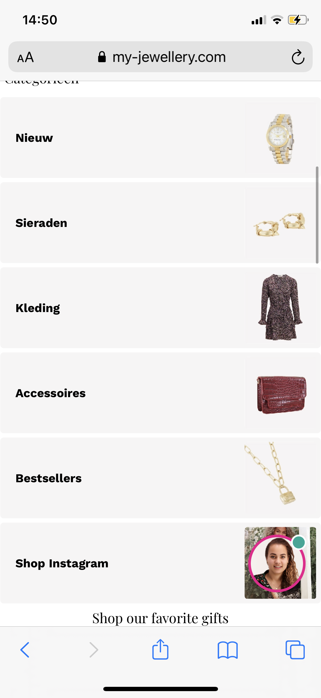
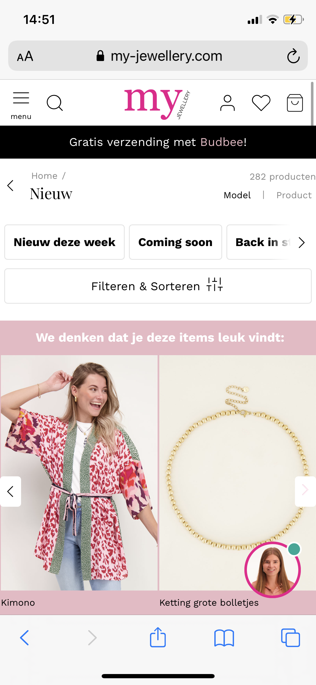
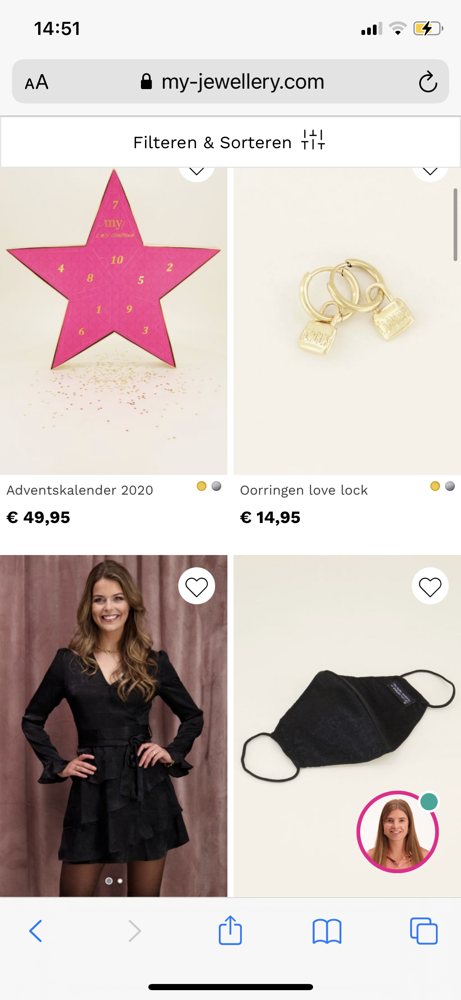

# Procesverslag
**Auteur:** Kim Nieuwenhuizen

Markdown cheat cheet: [Hulp bij het schrijven van Markdown](https://github.com/adam-p/markdown-here/wiki/Markdown-Cheatsheet). Nb. de standaardstructuur en de spartaanse opmaak zijn helemaal prima. Het gaat om de inhoud van je procesverslag. Besteedt de tijd voor pracht en praal aan je website.

## Bronnenlijst
1. DLO
2. Code Pen
3. https://www.w3schools.com/html/html_responsive.asp
4.

## Eindgesprek (week 7/8)

-dit ging goed & dit was lastig-

**Screenshot(s):**

-screenshot(s) van je eindresultaat-

## Voortgang 3 (week 6)

Opgestelde vragen voor de voortgang:
- Ik heb nu random sections gebruikt maar ik heb gehoord dat sections en articles een header moeten
hebben. Moet ik deze veranderen in divjes?

- Hoe werkt het :nth-of-type bij de detailpagina, telt het door of een id geven?

- Moet ik op de detailpagina de carrousel maken of is dit te lastig voor mij?

- Kenmerken / omschrijving / specificaties is volgensmij met javascript, moet ik dit maken
of kan dit ook onder elkaar?

Aantekeningen:

## Voortgang 2 (week 5)
### Agenda voor meeting

VOORTGANG 2 WEEK 5

-samen met je groepje opstellen-

| student 1: | student 2: | student 3 | student 4
| Babs | Kim | Dylan | Esther
| How to carrousel maken | IMG swipen en of klikken | Icoon rechts zetten | Hoe krijg hover langzaam
| Hoe minder regels CSS? | Show menutje | responsive | Tekst niet meeschalen puls rondje
| | | | slide tekst in footer

Aantekeningen:
- Afbeeldingen in photoshop zetten en zelfde pixels maken.
- :nth-of-type gebruiken <section> <ul> in css
- in list item plaatje, plaatje flexboxen

## Voortgang 1 (week 3)

### Stand van zaken

Ik heb een begin gemaakt aan de homepage. Ik had wat problemen met alle plaatjes vinden en de navigatiebar
flexboxen. Ik heb moeite met het beginnen. Hier heb ik Danny en Linda over gesproken en het is beter gegaan.

De standaard html en css gaat me wel goed af. Ik zie wel dat flexboxen me niet altijd lukt. Ook begreep ik
eerst niet dat je flexbox op de container moet zetten.

-dit ging goed & dit was lastig-

**Screenshot(s):**

-screenshot(s) van hoe ver je bent met korte uitleg-

### Agenda voor meeting

### Agenda voor meeting

VOORTGANG 1 WEEK 3

-samen met je groepje opstellen-

| student 1: | student 2: | student 3
| Babs | Kim | Esther
| Classes /ID's | Button ih midden plaatsen | Hoe Burger menu maken / header fixes krijgen
| HTML terug krijgen | UL vormgeven | nog een punt | dit wil ik zeker | IPV flexbox vervangen met Grid?
| Site op niveau? | Plaatjes van de NAV niet vd site | LU in NAV onderin / Alles met de footer
-samen met je groepje opstellen-

| student 1      | student 2          | student 3    | student 4        |
| ---            | ---                | ---          | ---              |
| dit bespreken  | en dit             | en ik dit    | en dan ik dat    |
| an dat ook nog | dit als er tijd is | nog een punt | dit wil ik zeker |
| ...            | ...                | ...          | ...              |

### Verslag van meeting

-na afloop snel uitkomsten vastleggen-

## Breakdownschets (week 1)

Breakdownschetsen had ik uitgeprint en met handgeschreven gemaakt.

## Intake (week 1)
-uitwerken voor de kick-off werkgroep - begin van de eerste week-

**Je startniveau:** Blauwe piste: Ik vind code lastig, ik oefen niet buiten de vakken. Ik vind hulp krijgen fijn want zo kom ik vooruit en leer ik ervan.

**Je focus:** Ik weet deze keuze nog niet zeker omdat het mij allebei leuk lijkt om te leren, maar voor nu is mijn keuze om de site helemaal responsive te maken.

**Je opdracht:** <https://www.my-jewellery.com/nl-nl/nieuw.html?p=2>

**Screenshot(s) van de eerste pagina (small screen):**

**Screenshot(s) van de tweede pagina (small screen):**

